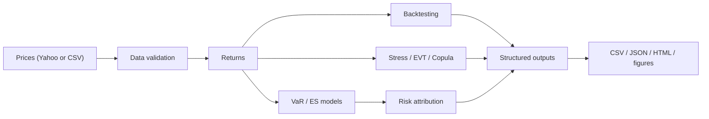

## VaR Risk Engine

A modular Python market-risk project for estimating portfolio **Value-at-Risk (VaR)** and **Expected Shortfall (ES)** with Historical Simulation, Parametric Variance-Covariance, Monte Carlo GBM, and GARCH-adjusted Monte Carlo methods. The engine also includes covariance estimation, backtesting, stress testing, EVT tail modelling, Gaussian vs Student-t copulas, and Component/Marginal VaR risk attribution.

The project is designed as an interview-ready risk and model-validation case study for Market Risk, Quant Risk, Model Risk, and Risk Analytics roles.

---

### What This Project Does

Given a multi-asset portfolio such as AAPL, MSFT, SPY, TLT, and GLD, the engine:

1. Fetches adjusted prices from Yahoo Finance and computes log returns
2. Estimates VaR and ES across multiple confidence levels
3. Compares Sample, Ledoit-Wolf, and EWMA covariance estimators
4. Simulates correlated GBM portfolio returns via Cholesky decomposition
5. Re-runs Monte Carlo VaR with one-day-ahead GARCH volatility forecasts
6. Backtests VaR forecasts with Kupiec POF and Christoffersen conditional coverage tests
7. Applies Basel traffic-light classification only under its standard 99% VaR / 250-observation setting
8. Fits GARCH(1,1), EGARCH, and GJR-GARCH models for volatility clustering and leverage effects
9. Runs historical, hypothetical, and reverse stress tests
10. Fits EVT Peaks-over-Threshold GPD models with Q-Q, mean-excess, and threshold-stability diagnostics
11. Fits Gaussian and Student-t copulas to compare linear correlation and tail dependence
12. Decomposes portfolio VaR into Component VaR and Marginal VaR using Euler allocation
13. Generates 15 analysis figures across the full pipeline

### Quick Start

```bash
git clone https://github.com/Quentinluoqz/var-risk-engine.git
cd var-risk-engine
pip install -e ".[dev]"

# Run the default analysis
var-engine

# One-command offline demo, no Yahoo Finance or network required
var-engine --offline --output outputs/offline_demo

# Or configure the portfolio from the CLI
var-engine --input data/sample_prices.csv --tickers AAPL,MSFT,SPY,TLT,GLD --weights 0.25,0.25,0.20,0.15,0.15 --confidence 0.95 --n-sims 5000 --output outputs/csv_demo

# Or run from YAML config
var-engine --config configs/demo.yaml

# Quality checks
pytest tests/ -q
ruff check src tests
```

The pipeline writes a complete run directory containing `metrics.json`, CSV tables, figures, and `report.html`.

For offline demonstrations and tests, a deterministic price sample is available at `data/sample_prices.csv`.

### Output Artifacts

```text
outputs/offline_demo/
├── metrics.json
├── var_es_table.csv
├── backtesting_results.csv
├── stress_results.csv
├── risk_attribution.csv
├── data_quality.csv
├── report.html
└── figures/
    ├── backtesting.png
    ├── evt_threshold_diagnostics.png
    └── ...
```

### Architecture



---

### Methods Explained

**Value-at-Risk (VaR)** estimates the loss threshold exceeded with probability `1 - confidence`. A 95% daily VaR of 1.69% means losses exceeded 1.69% on roughly 1 out of 20 trading days under the model.

**Expected Shortfall (ES)** estimates the average loss conditional on exceeding VaR. ES is coherent and is central to Basel/FRTB market-risk capital discussions.

**Historical VaR** uses empirical quantiles with no distributional assumption. It is transparent but sample-dependent.

**Parametric VaR** uses the normal delta approach from the portfolio mean and covariance. It is fast but can underestimate fat tails.

**Monte Carlo VaR** simulates correlated GBM terminal returns. The baseline uses historical annualised volatilities, while the GARCH-adjusted variant replaces each asset's unconditional volatility with a one-day-ahead GARCH forecast.

**Backtesting** reports Kupiec POF and Christoffersen conditional coverage tests. Basel traffic-light output is intentionally restricted to the standard 99% VaR / 250-observation use case to avoid mixing regulatory and diagnostic interpretations.

**EVT** fits a Generalised Pareto Distribution to tail losses above candidate thresholds. The project includes mean-excess and threshold-stability diagnostics so the threshold choice can be discussed rather than asserted.

**Copulas** separate marginal distributions from dependence. The Student-t copula uses pseudo-observations transformed through the Student-t inverse CDF in the likelihood, then compares pairwise tail-dependence coefficients against the Gaussian copula's zero tail dependence.

**Risk Attribution** decomposes parametric VaR into additive Component VaR and Marginal VaR so the portfolio's main risk drivers are visible.

---

### Project Structure

```text
var-risk-engine/
├── src/var_risk_engine/
│   ├── cli.py                # Command-line interface
│   ├── portfolio.py          # Portfolio dataclass with weight validation
│   ├── data.py               # Yahoo Finance data fetching with local cache
│   ├── data_validation.py    # Input data-quality checks
│   ├── config.py             # YAML configuration loader
│   ├── var_historical.py     # Historical VaR
│   ├── var_parametric.py     # Parametric VaR
│   ├── var_montecarlo.py     # Monte Carlo VaR
│   ├── expected_shortfall.py # Historical and parametric ES
│   ├── covariance.py         # Sample, Ledoit-Wolf, EWMA covariance
│   ├── backtesting.py        # Kupiec, Christoffersen, Basel helper
│   ├── volatility.py         # GARCH-family volatility models
│   ├── stress_testing.py     # Stress and reverse-stress tests
│   ├── evt.py                # EVT POT/GPD and threshold diagnostics
│   ├── copula.py             # Gaussian and Student-t copulas
│   ├── risk_attribution.py   # Component and Marginal VaR
│   ├── reporting/            # Plots, JSON, CSV, and HTML exports
│   ├── pipelines/            # Full analysis orchestration
│   └── main.py               # Backward-compatible analysis helpers
├── notebooks/
│   ├── 01_data_exploration.ipynb
│   ├── 02_var_comparison.ipynb
│   ├── 03_backtesting.ipynb
│   ├── 04_evt_analysis.ipynb
│   ├── 05_copula_modelling.ipynb
│   └── 06_risk_attribution.ipynb
├── tests/
│   ├── test_var_methods.py
│   └── test_p0_p1_modules.py
├── docs/
│   ├── model_validation_note.md
│   ├── frtb_discussion.md
│   └── model_inventory.md
├── data/
│   ├── sample_prices.csv
│   └── cache/
├── configs/
│   └── demo.yaml
├── .github/workflows/ci.yml
├── Dockerfile
├── .pre-commit-config.yaml
├── pyproject.toml
├── Makefile
└── LICENSE
```

---

### Current Quality Gates

- `87` tests pass, including an offline end-to-end smoke test
- `ruff check src tests` passes
- Coverage is about `90%`
- GitHub Actions CI runs lint and tests on Python 3.10 and 3.12
- CLI supports CSV input, offline mode, YAML config, configurable portfolio, and output directories
- Backtesting separates statistical diagnostics from Basel regulatory classification
- Project-level cache lives under `data/cache/`, with backward-compatible legacy cache fallback

### Docker

```bash
make docker-build
make docker-run
```

### Sample Output

Default portfolio: AAPL 25%, MSFT 25%, SPY 20%, TLT 15%, GLD 15%, using data from 2019 onward.

| Method | VaR (95%) | ES (95%) |
|---|---:|---:|
| Historical | 0.0169 | 0.0257 |
| Parametric | 0.0174 | 0.0219 |
| Monte Carlo | 0.0193 | 0.0239 |

The exact GARCH-MC, EVT, and copula values vary with the latest cached data and model fits. The project reports these values directly in the pipeline output and stores supporting figures in `reports/figures/`.

---

### Limitations

This is a research and validation-oriented project, not a production risk system. Known limitations:

- Yahoo Finance data is convenient but not an institutional market-data source
- GBM is a simplified price process and does not capture jumps or stochastic correlation
- EVT threshold selection remains judgment-based, though diagnostics are now included
- Copula VaR uses empirical marginals and a fitted dependence structure, not a full front-office pricing stack
- Basel/FRTB treatment is explanatory; a full capital engine would need liquidity horizons, modellability, P&L attribution, and desk-level aggregation

See `docs/model_validation_note.md` and `docs/frtb_discussion.md` for the model-risk and regulatory framing.

### References

- Jorion, P. (2006). *Value at Risk: The New Benchmark for Managing Financial Risk*. McGraw-Hill.
- McNeil, A.J., Frey, R., & Embrechts, P. (2015). *Quantitative Risk Management*. Princeton University Press.
- Basel Committee (2019). *Minimum capital requirements for market risk*.
- Engle, R.F. (1982). *Autoregressive Conditional Heteroscedasticity with Estimates of the Variance of United Kingdom Inflation*. Econometrica.
- Bollerslev, T. (1986). *Generalized Autoregressive Conditional Heteroskedasticity*. Journal of Econometrics.

MIT License
